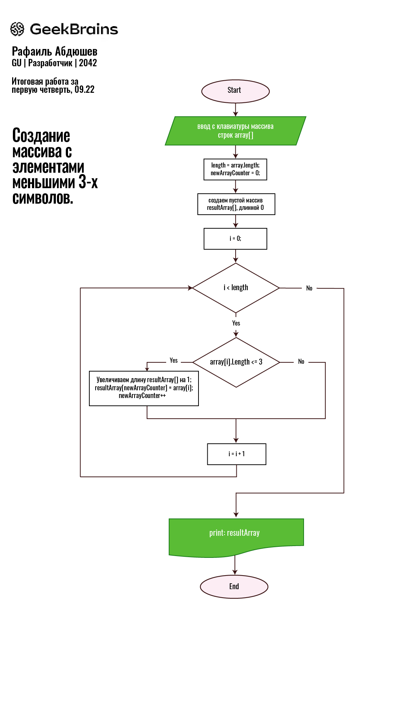

# Итоговая работа за 1 четверть.
#### Студент GeekBrains: Абдюшев Р.Н.
#### GU | Разработчик | 2042
 

Написанная программа находится в папке \Task_on_Csharp.
Пояснение:
* Модуль Main в файле Program.cs;
    > в данном модуле создан объект, методы которого затем
    > запускаются в модуле Main.

* В файле Addclass.cs создан класс для объекта (без конструктора);
    > класс содержит следующие методы:
    > ввод информации, создание нового массива, печать массивов.

* метод Initsets - предназначен для первоначального ввода массива с клавиатуры. 
Ограничиваю количество вводимых строк - переменная numberOfStrings.
Даю пользователю возможность выйти по набору строки 'end'.

* В методе CreateArray() создается результирующий массив. Используется 
встроенный метод Array.Resize().

* В методе PrintArray() печатаются и введенный массив и результирующий.

* Ниже приведена блок-схема к данной программе:
 

